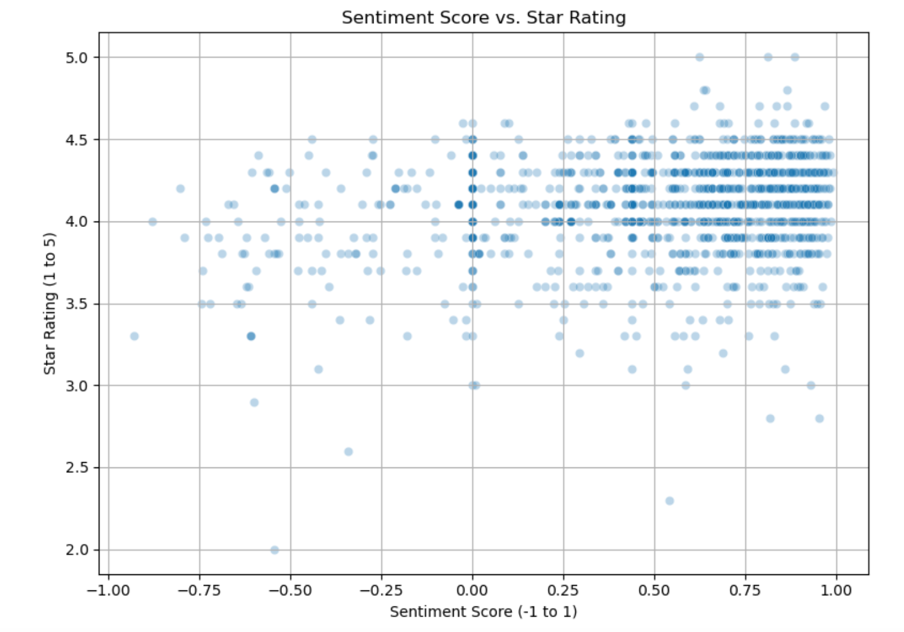
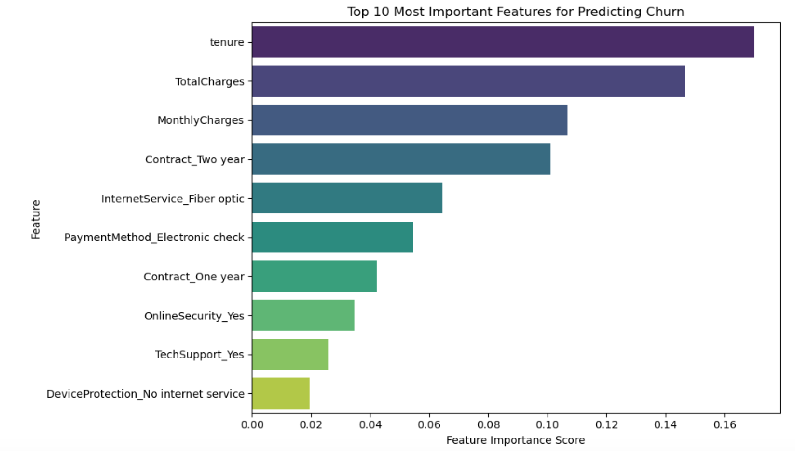
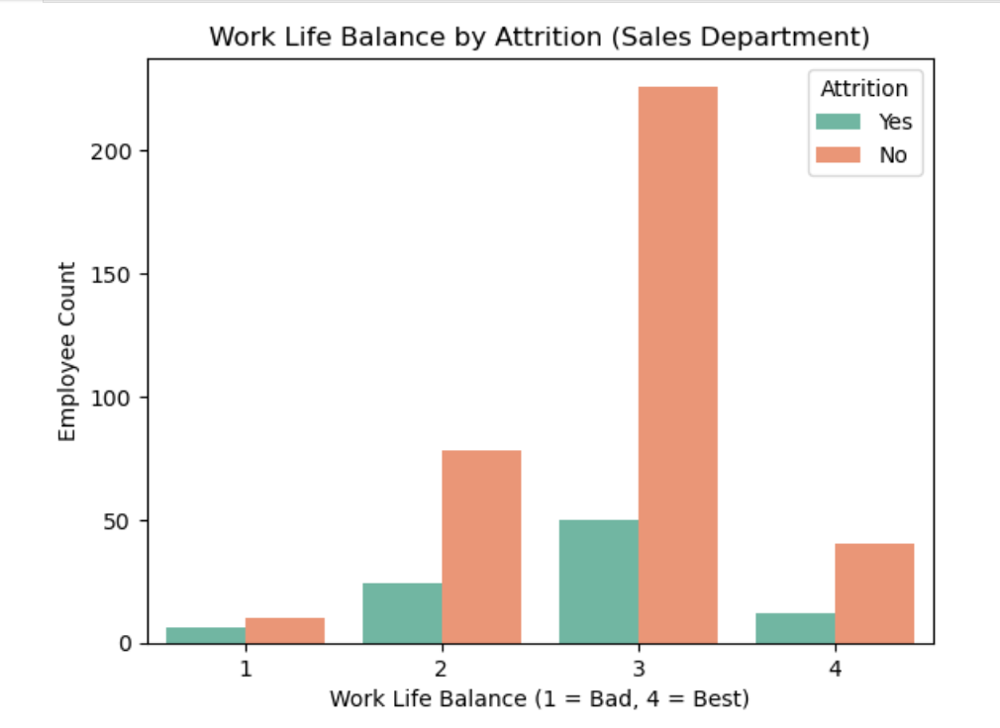

## About Me

Welcome! I’m Tania Green — a lifelong learner who loves using data to answer big questions. Scroll down to explore my handpicked projects, and feel free to reach out if one sparks your interest!

<a href="/files/TANIA_GREEN_Resume_2025_final.pdf" class="button" target="_blank">📄 View My Resume</a>
<a href="https://www.linkedin.com/in/taniagreen03" class="button" target="_blank">🔗 Connect on LinkedIn</a>

---

## Projects
### Decoding Customer Sentiment: Analyzing Amazon Reviews Across Product Categories 
Explored the alignment between customer-written Amazon reviews and their corresponding star ratings across various product categories. Utilizing Natural Language Processing (NLP) techniques such as **VADER**, the analysis aimed to determine whether the sentiment expressed in review texts accurately reflected the numerical ratings provided by customers. 

By applying **Pearson and Spearman** correlation tests, the project uncovered instances where sentiment and star ratings diverged — highlighting the complexity of customer feedback and the limitations of relying solely on numerical scores for product evaluation.

[Amazon Review Sentiment Analysis](https://github.com/taniaintech/amazon_sentiment_analysis)

### Telecom Churn Prediction
I built a predictive model to identify customers at risk of churning using a real-world telecom dataset. After performing exploratory data analysis (EDA) and feature engineering, I trained and evaluated multiple classification models, including **Logistic Regression** and **Random Forest**.

Random Forest achieved strong performance on the test set; however, cross-validation results showed that Logistic Regression consistently outperformed Random Forest in terms of F1 score (60% vs 55%). Since F1 score is a better measure for imbalanced classification tasks like churn prediction, Logistic Regression was selected as the final model. Key predictors of churn included contract type, tenure, payment method, and whether the customer had online security or tech support services.

[Telecom Churn Prediction](https://github.com/taniaintech/telecom_churn)

## Exploratory Data Analysis: HR Attrition
In this project, I explored an HR dataset to identify which departments experience the highest attrition and what employee-level factors may contribute to it. The Sales department had the highest attrition rate, and key influencing factors included age, income, commute distance, and work-life balance.

[EDA - HR Attrition](https://github.com/taniaintech/hr_attrition_eda)
